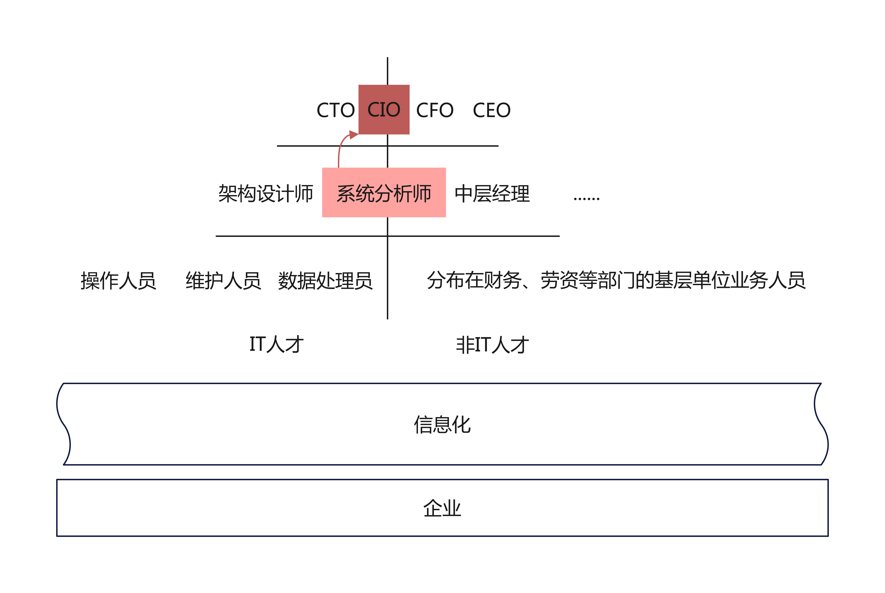

## 什么是系统分析师
在《系统分析师教程》前言中，这样描述系统分析师：
```
系统分析师的知识水平和工作能力直接决定了信息系统建设的成败。
......
一名合格的系统分析师：
不但应具备坚实的信息技术知识，掌握计算机技术的发展方向，而且还必须具备管理科学的知识；
不但要具备较强的系统观点和逻辑分析能力，能够从复杂的事务中抽象出系统模型，而且还要具备较好的口头和书面表达能力，较强的组织能力，善于与人共事；
不但具备扎实的理论值基础，还要具备丰富的项目实践经验。
```

看完之后我有两个感受：
- 那我走？（信息系统建设你是如此重要，还要我这系统架构设计师干嘛？）
- 我想要成为这样的人，尤其是第二个"不但......而且......"

那么到底如何？是骡子是马拉出来遛遛， 接下来就让我们深入了解一下系统分析师到底是什么样的人

系统分析师教程主要围绕企业信息化进行，对于系统分析师的定位可以看下图：



关于上图有几点需要补充说明：
- 企业为了更好的发展，必然进行信息化
- 信息化需要人才，人才可以从横向、纵向进行划分：
  - 横向分为IT人才和非IT人才
  - 纵向分为基层、中层、高层，呈金字塔形
- 系统分析师在横向上既是IT专家又是管理业务专家；纵向上处于中层
- 系统分析师的典型代表（努力方向）是CIO

下图是对系统分析师的全方位描述：


从上图可以看出：
- 系统分析师参与企业信息化的各个阶段，包括：信息化战略管理、信息化基础建设、信息系统建设、企业流程管理、信息资源开发利用
- 知识体系验证上述：既是IT专家，又是管理业务专家，可谓杰出的复合型人才
- 素质方面更是软实力超强，用一句话概括可谓：牵一发而动全身，系统分析师就是企业信息化的那一个头发

加油，为了成为杰出的复合型人才而不断努力！